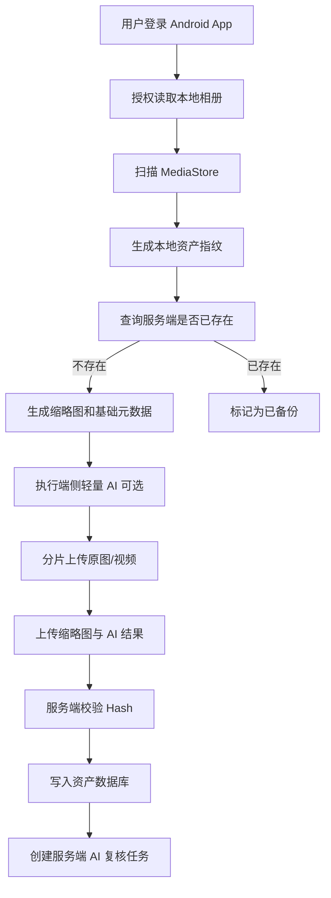
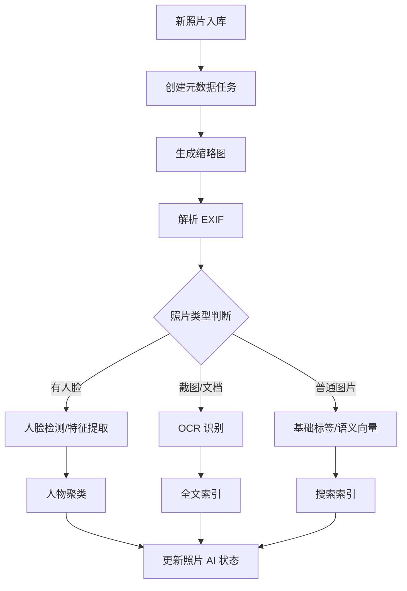

# PhotoAI MVP 功能清单、数据库设计与系统模块拆分

## 1. MVP 目标

PhotoAI 的 MVP 阶段目标不是一次性复刻完整手机厂相册，也不是做成复杂 NAS 套件，而是先跑通一条完整、可展示、可继续扩展的核心链路：

```text
Android 自动备份
→ Server 私有存储
→ Web 时间轴浏览
→ 缩略图与 EXIF 解析
→ AI 任务队列
→ 人脸识别与人物聚类
→ OCR 全文搜索
→ 中文关键词检索
```

MVP 必须证明三件事：

1. 用户可以把手机照片稳定备份到自己的服务器；
2. 用户可以像普通相册一样浏览、搜索和管理照片；
3. 系统具备 AI 智能整理能力，且 AI 任务可在服务器、手机端和后续 Assistant 之间拆分。

---

## 2. MVP 功能边界

### 2.1 必须实现

| 模块 | 功能 | MVP 要求 |
|---|---|---|
| 用户系统 | 本地账号 | 支持注册、登录、退出、修改基础信息 |
| 用户系统 | OAuth2 / OIDC | 支持配置第三方登录，至少完成通用 OIDC 登录流程 |
| 权限系统 | 用户隔离 | 每个用户只能访问自己的照片、相册、AI 结果 |
| 存储系统 | 本地目录存储 | 支持配置服务器本地照片根目录 |
| 存储系统 | 外部目录扫描 | 支持只读扫描 NFS/SMB/本地挂载目录 |
| 备份系统 | Android 自动备份 | 支持扫描 MediaStore 并上传照片/视频 |
| 备份系统 | 分片上传 | 大文件支持分片、断点续传、失败重试 |
| 备份系统 | 备份状态 | 显示已备份、待备份、失败、上传中数量 |
| 相册浏览 | 时间轴 | 按年月日浏览照片 |
| 相册浏览 | 照片详情 | 显示原图、缩略图、EXIF、AI 标签 |
| 相册浏览 | 视频基础播放 | 支持视频列表和播放地址 |
| 缩略图 | 图片缩略图 | 自动生成缩略图和预览图 |
| 元数据 | EXIF 解析 | 解析拍摄时间、设备、GPS、尺寸、方向 |
| AI 队列 | 任务调度 | 支持任务创建、领取、失败重试、状态追踪 |
| AI 识别 | 人脸检测 | 检测照片中的人脸位置 |
| AI 识别 | 人脸特征 | 提取 embedding 并入库 |
| AI 识别 | 人物聚类 | 按相似度归并人物 |
| AI 识别 | OCR | 识别截图、文档、证件等文字 |
| 搜索 | 关键词搜索 | 支持标题、标签、OCR 文本搜索 |
| 搜索 | 人物搜索 | 支持按人物查看照片 |
| 客户端协同 | 手机端识别结果上传 | 手机可上传 OCR、人脸检测、基础分类结果 |
| 运维 | Docker Compose | 支持一键启动基础服务 |

### 2.2 MVP 暂不实现

| 功能 | 暂缓原因 |
|---|---|
| iOS 客户端 | 后台限制复杂，先完成 Android 闭环 |
| Synology Photos 数据库读取 | 版本兼容和内部结构不稳定，不作为 MVP |
| 复杂家庭共享权限 | 权限模型会显著增加复杂度 |
| 地图相册高级交互 | 依赖前端地图组件和位置聚合，后续做 |
| 自动回忆相册 | 依赖更完整的 AI 标签和时间线分析 |
| AI 自动剪辑 | 视频分析成本较高 |
| 插件市场 | 非核心能力 |
| 多租户商业化管理 | MVP 先面向单家庭/单服务器 |

---

## 3. MVP 用户流程

### 3.1 手机备份流程



### 3.2 服务端 AI 处理流程



---

## 4. 系统模块拆分

### 4.1 后端服务模块

```text
photoai-server
├── app
│   ├── api              # REST API / 后续 GraphQL 可选
│   ├── auth             # 登录、OIDC、Token、权限
│   ├── users            # 用户、角色、配置
│   ├── assets           # 照片/视频资产管理
│   ├── albums           # 相册管理
│   ├── storage          # 存储抽象层
│   ├── upload           # 分片上传、断点续传
│   ├── metadata         # EXIF、文件元数据
│   ├── thumbnails       # 缩略图任务与访问
│   ├── ai               # AI 结果、任务、模型注册
│   ├── faces            # 人脸、人物、聚类
│   ├── ocr              # OCR 结果与索引
│   ├── search           # 搜索聚合
│   ├── jobs             # 任务队列
│   ├── config           # 系统配置
│   └── common           # 公共工具
├── migrations           # 数据库迁移
├── tests
└── main.py
```

### 4.2 Worker 模块

```text
photoai-workers
├── thumbnail-worker     # 缩略图、预览图、方向修正
├── metadata-worker      # EXIF、GPS、文件属性
├── face-worker          # 人脸检测、embedding
├── ocr-worker           # OCR 文字识别
├── clip-worker          # 语义向量
├── quality-worker       # 模糊、相似、质量评分
└── video-worker         # 视频抽帧、封面、基础转码
```

每个 Worker 都应支持独立启动和独立限制资源：

```text
PHOTOAI_WORKER_TYPE=face
PHOTOAI_WORKER_CONCURRENCY=1
PHOTOAI_MODEL_PROFILE=standard
PHOTOAI_IDLE_UNLOAD_SECONDS=600
```

### 4.3 Android 客户端模块

```text
photoai-android
├── auth                 # 登录、OIDC、Token 管理
├── media                # MediaStore 扫描
├── backup               # 自动备份、分片上传、失败重试
├── ai_local             # 端侧 OCR、人脸检测、分类
├── sync                 # 本地状态与服务端同步
├── gallery              # 时间轴和照片浏览
├── settings             # 备份策略、AI 策略
└── common
```

### 4.4 Web 前端模块

```text
photoai-web
├── auth                 # 登录、OIDC 回调
├── timeline             # 时间轴
├── asset                # 照片详情
├── albums               # 相册
├── people               # 人物相册
├── search               # 搜索
├── admin                # 系统设置、存储、任务
├── backup               # 备份状态
└── components
```

### 4.5 Desktop Assistant 模块

MVP 可先设计接口，不必须完成完整桌面端。

```text
photoai-assistant
├── register             # 节点注册
├── heartbeat            # 心跳和能力上报
├── task                 # 领取任务、回传结果
├── inference            # AI 推理
├── resource             # CPU/GPU/内存限制
└── ui                   # 简单控制面板
```

---

## 5. 数据库设计

数据库建议使用 PostgreSQL，向量字段使用 pgvector。MVP 阶段先保证结构清晰，后续再针对大图库做分区和索引优化。

### 5.1 核心表总览

| 表名 | 作用 |
|---|---|
| users | 用户 |
| user_auth_identities | 第三方登录身份 |
| user_settings | 用户配置 |
| storage_locations | 存储位置 |
| libraries | 图库 |
| library_users | 图库与用户关系 |
| assets | 照片/视频资产 |
| asset_files | 原图、缩略图、预览图等文件记录 |
| asset_metadata | EXIF 和媒体元数据 |
| albums | 相册 |
| album_assets | 相册与资产关系 |
| upload_sessions | 分片上传会话 |
| upload_parts | 上传分片 |
| ai_tasks | AI 任务 |
| ai_results | AI 识别结果 |
| faces | 检测到的人脸 |
| persons | 人物 |
| person_faces | 人物与人脸关系 |
| ocr_results | OCR 结果 |
| tags | 标签 |
| asset_tags | 资产标签 |
| search_documents | 搜索索引辅助表 |
| model_registry | 模型注册 |
| compute_nodes | Assistant / 客户端算力节点 |
| audit_logs | 操作日志 |

---

## 5.2 用户与认证表

### users

```sql
CREATE TABLE users (
    id UUID PRIMARY KEY,
    username VARCHAR(64) NOT NULL UNIQUE,
    display_name VARCHAR(128),
    email VARCHAR(255) UNIQUE,
    password_hash TEXT,
    avatar_asset_id UUID,
    status VARCHAR(32) NOT NULL DEFAULT 'active',
    role VARCHAR(32) NOT NULL DEFAULT 'user',
    storage_quota_bytes BIGINT,
    used_storage_bytes BIGINT NOT NULL DEFAULT 0,
    created_at TIMESTAMPTZ NOT NULL DEFAULT now(),
    updated_at TIMESTAMPTZ NOT NULL DEFAULT now()
);
```

说明：

- `password_hash` 可为空，用于只通过 OIDC 登录的用户；
- `role` MVP 只需要 `admin` 和 `user`；
- `storage_quota_bytes` 为空表示不限额。

### user_auth_identities

```sql
CREATE TABLE user_auth_identities (
    id UUID PRIMARY KEY,
    user_id UUID NOT NULL REFERENCES users(id) ON DELETE CASCADE,
    provider VARCHAR(64) NOT NULL,
    provider_user_id VARCHAR(255) NOT NULL,
    provider_username VARCHAR(255),
    provider_email VARCHAR(255),
    raw_profile JSONB,
    created_at TIMESTAMPTZ NOT NULL DEFAULT now(),
    UNIQUE(provider, provider_user_id)
);
```

用于保存 OIDC / OAuth2 身份绑定。

### user_settings

```sql
CREATE TABLE user_settings (
    user_id UUID PRIMARY KEY REFERENCES users(id) ON DELETE CASCADE,
    backup_policy JSONB NOT NULL DEFAULT '{}'::jsonb,
    ai_policy JSONB NOT NULL DEFAULT '{}'::jsonb,
    privacy_policy JSONB NOT NULL DEFAULT '{}'::jsonb,
    ui_preferences JSONB NOT NULL DEFAULT '{}'::jsonb,
    updated_at TIMESTAMPTZ NOT NULL DEFAULT now()
);
```

---

## 5.3 存储与图库表

### storage_locations

```sql
CREATE TABLE storage_locations (
    id UUID PRIMARY KEY,
    name VARCHAR(128) NOT NULL,
    type VARCHAR(32) NOT NULL,
    base_path TEXT NOT NULL,
    is_readonly BOOLEAN NOT NULL DEFAULT false,
    status VARCHAR(32) NOT NULL DEFAULT 'active',
    config JSONB NOT NULL DEFAULT '{}'::jsonb,
    created_at TIMESTAMPTZ NOT NULL DEFAULT now(),
    updated_at TIMESTAMPTZ NOT NULL DEFAULT now()
);
```

`type` 可取：

```text
local
nfs
smb
synology
truenas
external
```

### libraries

```sql
CREATE TABLE libraries (
    id UUID PRIMARY KEY,
    storage_location_id UUID NOT NULL REFERENCES storage_locations(id),
    owner_user_id UUID REFERENCES users(id),
    name VARCHAR(128) NOT NULL,
    library_type VARCHAR(32) NOT NULL DEFAULT 'managed',
    root_path TEXT NOT NULL,
    is_readonly BOOLEAN NOT NULL DEFAULT false,
    scan_enabled BOOLEAN NOT NULL DEFAULT true,
    last_scan_at TIMESTAMPTZ,
    created_at TIMESTAMPTZ NOT NULL DEFAULT now(),
    updated_at TIMESTAMPTZ NOT NULL DEFAULT now()
);
```

`library_type`：

```text
managed      # PhotoAI 管理目录
external     # 外部只读图库
import       # 临时导入目录
```

### library_users

```sql
CREATE TABLE library_users (
    library_id UUID NOT NULL REFERENCES libraries(id) ON DELETE CASCADE,
    user_id UUID NOT NULL REFERENCES users(id) ON DELETE CASCADE,
    permission VARCHAR(32) NOT NULL DEFAULT 'owner',
    created_at TIMESTAMPTZ NOT NULL DEFAULT now(),
    PRIMARY KEY (library_id, user_id)
);
```

---

## 5.4 资产表

### assets

```sql
CREATE TABLE assets (
    id UUID PRIMARY KEY,
    owner_user_id UUID NOT NULL REFERENCES users(id) ON DELETE CASCADE,
    library_id UUID REFERENCES libraries(id),
    asset_type VARCHAR(16) NOT NULL,
    original_filename TEXT NOT NULL,
    file_hash VARCHAR(128) NOT NULL,
    device_asset_id TEXT,
    device_id UUID,
    mime_type VARCHAR(128),
    file_size BIGINT NOT NULL,
    width INTEGER,
    height INTEGER,
    duration_ms BIGINT,
    taken_at TIMESTAMPTZ,
    imported_at TIMESTAMPTZ NOT NULL DEFAULT now(),
    visibility VARCHAR(32) NOT NULL DEFAULT 'private',
    status VARCHAR(32) NOT NULL DEFAULT 'active',
    ai_status VARCHAR(32) NOT NULL DEFAULT 'pending',
    favorite BOOLEAN NOT NULL DEFAULT false,
    hidden BOOLEAN NOT NULL DEFAULT false,
    deleted_at TIMESTAMPTZ,
    created_at TIMESTAMPTZ NOT NULL DEFAULT now(),
    updated_at TIMESTAMPTZ NOT NULL DEFAULT now(),
    UNIQUE(owner_user_id, file_hash)
);
```

`asset_type`：

```text
photo
video
live_photo
unknown
```

`ai_status`：

```text
pending
processing
partial
completed
failed
```

### asset_files

```sql
CREATE TABLE asset_files (
    id UUID PRIMARY KEY,
    asset_id UUID NOT NULL REFERENCES assets(id) ON DELETE CASCADE,
    file_role VARCHAR(32) NOT NULL,
    storage_location_id UUID NOT NULL REFERENCES storage_locations(id),
    relative_path TEXT NOT NULL,
    file_size BIGINT,
    mime_type VARCHAR(128),
    checksum VARCHAR(128),
    width INTEGER,
    height INTEGER,
    created_at TIMESTAMPTZ NOT NULL DEFAULT now(),
    UNIQUE(asset_id, file_role)
);
```

`file_role`：

```text
original
thumbnail
preview
video_cover
transcoded_video
sidecar
```

### asset_metadata

```sql
CREATE TABLE asset_metadata (
    asset_id UUID PRIMARY KEY REFERENCES assets(id) ON DELETE CASCADE,
    camera_make VARCHAR(128),
    camera_model VARCHAR(128),
    lens_model VARCHAR(128),
    focal_length VARCHAR(64),
    aperture VARCHAR(64),
    exposure_time VARCHAR(64),
    iso INTEGER,
    orientation INTEGER,
    gps_latitude DOUBLE PRECISION,
    gps_longitude DOUBLE PRECISION,
    gps_altitude DOUBLE PRECISION,
    city VARCHAR(128),
    province VARCHAR(128),
    country VARCHAR(128),
    raw_exif JSONB,
    created_at TIMESTAMPTZ NOT NULL DEFAULT now(),
    updated_at TIMESTAMPTZ NOT NULL DEFAULT now()
);
```

---

## 5.5 相册表

### albums

```sql
CREATE TABLE albums (
    id UUID PRIMARY KEY,
    owner_user_id UUID NOT NULL REFERENCES users(id) ON DELETE CASCADE,
    name VARCHAR(128) NOT NULL,
    description TEXT,
    album_type VARCHAR(32) NOT NULL DEFAULT 'manual',
    cover_asset_id UUID,
    visibility VARCHAR(32) NOT NULL DEFAULT 'private',
    sort_order VARCHAR(32) NOT NULL DEFAULT 'taken_at_desc',
    created_at TIMESTAMPTZ NOT NULL DEFAULT now(),
    updated_at TIMESTAMPTZ NOT NULL DEFAULT now()
);
```

`album_type`：

```text
manual
person
smart
shared
system
```

### album_assets

```sql
CREATE TABLE album_assets (
    album_id UUID NOT NULL REFERENCES albums(id) ON DELETE CASCADE,
    asset_id UUID NOT NULL REFERENCES assets(id) ON DELETE CASCADE,
    added_by_user_id UUID REFERENCES users(id),
    sort_index INTEGER,
    created_at TIMESTAMPTZ NOT NULL DEFAULT now(),
    PRIMARY KEY (album_id, asset_id)
);
```

---

## 5.6 上传表

### upload_sessions

```sql
CREATE TABLE upload_sessions (
    id UUID PRIMARY KEY,
    user_id UUID NOT NULL REFERENCES users(id) ON DELETE CASCADE,
    device_id UUID,
    filename TEXT NOT NULL,
    file_hash VARCHAR(128) NOT NULL,
    file_size BIGINT NOT NULL,
    mime_type VARCHAR(128),
    chunk_size INTEGER NOT NULL,
    total_chunks INTEGER NOT NULL,
    uploaded_chunks INTEGER NOT NULL DEFAULT 0,
    status VARCHAR(32) NOT NULL DEFAULT 'uploading',
    target_library_id UUID REFERENCES libraries(id),
    created_at TIMESTAMPTZ NOT NULL DEFAULT now(),
    updated_at TIMESTAMPTZ NOT NULL DEFAULT now(),
    expires_at TIMESTAMPTZ
);
```

### upload_parts

```sql
CREATE TABLE upload_parts (
    id UUID PRIMARY KEY,
    upload_session_id UUID NOT NULL REFERENCES upload_sessions(id) ON DELETE CASCADE,
    part_index INTEGER NOT NULL,
    part_size INTEGER NOT NULL,
    checksum VARCHAR(128),
    temp_path TEXT NOT NULL,
    status VARCHAR(32) NOT NULL DEFAULT 'uploaded',
    created_at TIMESTAMPTZ NOT NULL DEFAULT now(),
    UNIQUE(upload_session_id, part_index)
);
```

---

## 5.7 AI 任务与结果表

### ai_tasks

```sql
CREATE TABLE ai_tasks (
    id UUID PRIMARY KEY,
    asset_id UUID REFERENCES assets(id) ON DELETE CASCADE,
    user_id UUID REFERENCES users(id) ON DELETE CASCADE,
    task_type VARCHAR(32) NOT NULL,
    priority INTEGER NOT NULL DEFAULT 100,
    status VARCHAR(32) NOT NULL DEFAULT 'pending',
    assigned_node_id UUID,
    attempts INTEGER NOT NULL DEFAULT 0,
    max_attempts INTEGER NOT NULL DEFAULT 3,
    input JSONB NOT NULL DEFAULT '{}'::jsonb,
    output JSONB,
    error_message TEXT,
    scheduled_at TIMESTAMPTZ NOT NULL DEFAULT now(),
    started_at TIMESTAMPTZ,
    finished_at TIMESTAMPTZ,
    created_at TIMESTAMPTZ NOT NULL DEFAULT now()
);
```

`task_type`：

```text
thumbnail
metadata
face_detect
face_embed
face_cluster
ocr
clip_embed
label
quality
video_extract
```

### ai_results

```sql
CREATE TABLE ai_results (
    id UUID PRIMARY KEY,
    asset_id UUID NOT NULL REFERENCES assets(id) ON DELETE CASCADE,
    task_type VARCHAR(32) NOT NULL,
    result_json JSONB NOT NULL,
    engine VARCHAR(64) NOT NULL,
    model_name VARCHAR(128),
    model_version VARCHAR(64),
    device_id UUID,
    compute_node_id UUID,
    confidence DOUBLE PRECISION,
    status VARCHAR(32) NOT NULL DEFAULT 'pending',
    source VARCHAR(32) NOT NULL DEFAULT 'server',
    created_at TIMESTAMPTZ NOT NULL DEFAULT now(),
    updated_at TIMESTAMPTZ NOT NULL DEFAULT now()
);
```

`source`：

```text
server
mobile
assistant
imported
```

`status`：

```text
pending
accepted
rejected
need_review
user_confirmed
```

---

## 5.8 人脸与人物表

### faces

```sql
CREATE TABLE faces (
    id UUID PRIMARY KEY,
    asset_id UUID NOT NULL REFERENCES assets(id) ON DELETE CASCADE,
    owner_user_id UUID NOT NULL REFERENCES users(id) ON DELETE CASCADE,
    bounding_box JSONB NOT NULL,
    landmarks JSONB,
    face_crop_file_id UUID REFERENCES asset_files(id),
    embedding vector(512),
    quality_score DOUBLE PRECISION,
    confidence DOUBLE PRECISION,
    detection_engine VARCHAR(64),
    model_version VARCHAR(64),
    status VARCHAR(32) NOT NULL DEFAULT 'active',
    created_at TIMESTAMPTZ NOT NULL DEFAULT now()
);
```

### persons

```sql
CREATE TABLE persons (
    id UUID PRIMARY KEY,
    owner_user_id UUID NOT NULL REFERENCES users(id) ON DELETE CASCADE,
    name VARCHAR(128),
    cover_face_id UUID,
    cover_asset_id UUID,
    face_count INTEGER NOT NULL DEFAULT 0,
    is_hidden BOOLEAN NOT NULL DEFAULT false,
    is_confirmed BOOLEAN NOT NULL DEFAULT false,
    created_at TIMESTAMPTZ NOT NULL DEFAULT now(),
    updated_at TIMESTAMPTZ NOT NULL DEFAULT now()
);
```

### person_faces

```sql
CREATE TABLE person_faces (
    person_id UUID NOT NULL REFERENCES persons(id) ON DELETE CASCADE,
    face_id UUID NOT NULL REFERENCES faces(id) ON DELETE CASCADE,
    relation_status VARCHAR(32) NOT NULL DEFAULT 'auto',
    confidence DOUBLE PRECISION,
    created_at TIMESTAMPTZ NOT NULL DEFAULT now(),
    PRIMARY KEY (person_id, face_id)
);
```

`relation_status`：

```text
auto
confirmed
rejected
suggested
```

---

## 5.9 OCR 与标签表

### ocr_results

```sql
CREATE TABLE ocr_results (
    id UUID PRIMARY KEY,
    asset_id UUID NOT NULL REFERENCES assets(id) ON DELETE CASCADE,
    owner_user_id UUID NOT NULL REFERENCES users(id) ON DELETE CASCADE,
    full_text TEXT NOT NULL,
    blocks JSONB,
    language VARCHAR(32),
    confidence DOUBLE PRECISION,
    engine VARCHAR(64),
    model_version VARCHAR(64),
    source VARCHAR(32) NOT NULL DEFAULT 'server',
    created_at TIMESTAMPTZ NOT NULL DEFAULT now(),
    updated_at TIMESTAMPTZ NOT NULL DEFAULT now()
);
```

### tags

```sql
CREATE TABLE tags (
    id UUID PRIMARY KEY,
    owner_user_id UUID REFERENCES users(id) ON DELETE CASCADE,
    name VARCHAR(128) NOT NULL,
    tag_type VARCHAR(32) NOT NULL DEFAULT 'ai',
    created_at TIMESTAMPTZ NOT NULL DEFAULT now(),
    UNIQUE(owner_user_id, name)
);
```

### asset_tags

```sql
CREATE TABLE asset_tags (
    asset_id UUID NOT NULL REFERENCES assets(id) ON DELETE CASCADE,
    tag_id UUID NOT NULL REFERENCES tags(id) ON DELETE CASCADE,
    source VARCHAR(32) NOT NULL DEFAULT 'ai',
    confidence DOUBLE PRECISION,
    created_at TIMESTAMPTZ NOT NULL DEFAULT now(),
    PRIMARY KEY (asset_id, tag_id)
);
```

---

## 5.10 搜索与模型表

### search_documents

```sql
CREATE TABLE search_documents (
    asset_id UUID PRIMARY KEY REFERENCES assets(id) ON DELETE CASCADE,
    owner_user_id UUID NOT NULL REFERENCES users(id) ON DELETE CASCADE,
    search_text TEXT,
    ocr_text TEXT,
    tag_text TEXT,
    person_text TEXT,
    location_text TEXT,
    embedding vector(768),
    updated_at TIMESTAMPTZ NOT NULL DEFAULT now()
);
```

### model_registry

```sql
CREATE TABLE model_registry (
    id UUID PRIMARY KEY,
    model_name VARCHAR(128) NOT NULL,
    model_version VARCHAR(64) NOT NULL,
    task_type VARCHAR(32) NOT NULL,
    platform VARCHAR(64) NOT NULL,
    profile VARCHAR(32) NOT NULL DEFAULT 'standard',
    file_path TEXT,
    download_url TEXT,
    checksum VARCHAR(128),
    input_schema JSONB,
    output_schema JSONB,
    enabled BOOLEAN NOT NULL DEFAULT true,
    created_at TIMESTAMPTZ NOT NULL DEFAULT now(),
    UNIQUE(model_name, model_version, platform, profile)
);
```

### compute_nodes

```sql
CREATE TABLE compute_nodes (
    id UUID PRIMARY KEY,
    owner_user_id UUID REFERENCES users(id) ON DELETE SET NULL,
    node_name VARCHAR(128) NOT NULL,
    node_type VARCHAR(32) NOT NULL,
    platform VARCHAR(64),
    capabilities JSONB NOT NULL DEFAULT '{}'::jsonb,
    status VARCHAR(32) NOT NULL DEFAULT 'offline',
    last_seen_at TIMESTAMPTZ,
    created_at TIMESTAMPTZ NOT NULL DEFAULT now()
);
```

`node_type`：

```text
server
mobile
assistant
```

---

## 6. 推荐索引

```sql
CREATE INDEX idx_assets_owner_taken_at ON assets(owner_user_id, taken_at DESC);
CREATE INDEX idx_assets_owner_hash ON assets(owner_user_id, file_hash);
CREATE INDEX idx_assets_library ON assets(library_id);
CREATE INDEX idx_assets_ai_status ON assets(ai_status);

CREATE INDEX idx_ai_tasks_status_priority ON ai_tasks(status, priority, scheduled_at);
CREATE INDEX idx_ai_tasks_asset_type ON ai_tasks(asset_id, task_type);

CREATE INDEX idx_faces_asset ON faces(asset_id);
CREATE INDEX idx_faces_owner ON faces(owner_user_id);
CREATE INDEX idx_persons_owner ON persons(owner_user_id);
CREATE INDEX idx_person_faces_face ON person_faces(face_id);

CREATE INDEX idx_ocr_owner ON ocr_results(owner_user_id);
CREATE INDEX idx_ocr_fulltext ON ocr_results USING GIN (to_tsvector('simple', full_text));

CREATE INDEX idx_search_text ON search_documents USING GIN (
    to_tsvector('simple', coalesce(search_text, '') || ' ' || coalesce(ocr_text, '') || ' ' || coalesce(tag_text, ''))
);
```

向量索引在数据量达到一定规模后再开启：

```sql
CREATE INDEX idx_faces_embedding_hnsw
ON faces USING hnsw (embedding vector_cosine_ops);

CREATE INDEX idx_search_embedding_hnsw
ON search_documents USING hnsw (embedding vector_cosine_ops);
```

---

## 7. API 模块规划

### 7.1 Auth API

```text
POST   /api/auth/login
POST   /api/auth/logout
POST   /api/auth/refresh
GET    /api/auth/me
GET    /api/auth/oidc/{provider}/authorize
GET    /api/auth/oidc/{provider}/callback
```

### 7.2 Asset API

```text
GET    /api/assets
GET    /api/assets/{id}
DELETE /api/assets/{id}
POST   /api/assets/{id}/favorite
DELETE /api/assets/{id}/favorite
GET    /api/assets/{id}/original
GET    /api/assets/{id}/thumbnail
GET    /api/assets/{id}/preview
```

### 7.3 Upload API

```text
POST   /api/uploads/sessions
PUT    /api/uploads/sessions/{id}/parts/{part_index}
POST   /api/uploads/sessions/{id}/complete
GET    /api/uploads/sessions/{id}
DELETE /api/uploads/sessions/{id}
```

### 7.4 Album API

```text
GET    /api/albums
POST   /api/albums
GET    /api/albums/{id}
PATCH  /api/albums/{id}
DELETE /api/albums/{id}
POST   /api/albums/{id}/assets
DELETE /api/albums/{id}/assets/{asset_id}
```

### 7.5 People API

```text
GET    /api/people
GET    /api/people/{id}
PATCH  /api/people/{id}
GET    /api/people/{id}/assets
POST   /api/people/{id}/merge
POST   /api/people/{id}/faces/{face_id}/confirm
POST   /api/people/{id}/faces/{face_id}/reject
```

### 7.6 Search API

```text
GET    /api/search?q=
GET    /api/search/ocr?q=
GET    /api/search/people?q=
POST   /api/search/semantic
```

### 7.7 AI API

```text
GET    /api/ai/tasks
POST   /api/ai/tasks
POST   /api/ai/results
GET    /api/ai/results/{asset_id}
POST   /api/ai/reprocess/{asset_id}
```

### 7.8 Compute Node API

```text
POST   /api/compute-nodes/register
POST   /api/compute-nodes/{id}/heartbeat
POST   /api/compute-nodes/{id}/claim-task
POST   /api/compute-nodes/{id}/submit-result
```

---

## 8. MVP 任务拆分建议

### Milestone 1：后端和数据库

- 初始化 FastAPI 项目；
- 接入 PostgreSQL；
- 编写 Alembic 迁移；
- 完成 users、assets、asset_files、libraries 基础表；
- 完成 JWT 登录；
- 完成基础权限中间件。

### Milestone 2：上传与存储

- 实现 storage adapter；
- 实现分片上传；
- 实现 hash 校验；
- 实现原图入库；
- 实现缩略图生成任务；
- 实现照片列表 API。

### Milestone 3：Web 时间轴

- 初始化 Vue 项目；
- 实现登录页；
- 实现时间轴；
- 实现照片详情；
- 实现收藏和删除；
- 实现基础搜索框。

### Milestone 4：Android 备份

- MediaStore 扫描；
- 本地资产状态库；
- 分片上传；
- Wi-Fi/充电约束；
- 备份状态页；
- 失败重试。

### Milestone 5：AI 基础

- AI 任务表；
- Worker 任务领取；
- EXIF 解析；
- 人脸检测；
- OCR；
- AI 结果入库；
- 人物聚类初版；
- OCR 搜索。

### Milestone 6：端侧协同

- 手机端 OCR 结果上传；
- 手机端人脸框上传；
- 服务端结果合并；
- 低置信度复核策略；
- AI 设置页。

---

## 9. MVP 验收标准

### 9.1 基础验收

1. Android 可以自动备份至少 1000 张照片；
2. 中断网络后可继续断点上传；
3. Web 端可按时间线浏览；
4. 原图、缩略图、预览图路径正确；
5. 用户 A 无法访问用户 B 的照片；
6. 支持本地账号登录；
7. 支持至少一个 OIDC Provider 登录。

### 9.2 AI 验收

1. 照片入库后能自动生成 AI 任务；
2. 有人脸照片能检测出人脸框；
3. 同一人物能初步聚类；
4. 用户可以手动命名人物；
5. 截图或文档照片能被 OCR；
6. 搜索 OCR 文本可以找到对应图片；
7. AI 任务失败后可重试；
8. 低置信度结果不会直接覆盖用户确认结果。

### 9.3 性能验收

1. 纯 CPU 环境可运行；
2. 16GB 内存环境下基础服务可稳定运行；
3. Worker 可限制并发；
4. 模型空闲后可释放；
5. 上传、浏览、AI 处理互不阻塞。

---

## 10. 后续增强方向

MVP 完成后再进入增强阶段：

1. Assistant 节点；
2. 高精度 CLIP 语义搜索；
3. 家庭共享相册；
4. 相似照片清理；
5. 低质量照片清理；
6. 地图相册；
7. 群晖 Photos 迁移工具；
8. iOS 客户端；
9. 多语言 UI；
10. 插件化 AI 模型管理。
