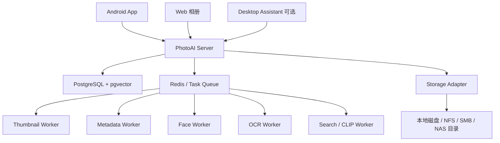

# PhotoAI

PhotoAI 是一套面向 x86 NAS、家庭服务器和私有云环境的私有 AI 智能相册系统。它的目标是替代传统 NAS 相册应用，在照片备份、时间轴浏览、人脸识别、OCR 搜索、中文语义搜索和多端协同 AI 计算方面提供更接近手机厂相册的体验。

PhotoAI 不强绑定群晖、TrueNAS 或某一类 NAS 系统。它可以运行在普通 Linux 服务器、迷你主机、Proxmox 虚拟机、Docker 主机或家庭服务器中，并通过本地目录、NFS、SMB 等方式接入照片存储。

## 核心特性

- 手机照片和视频自动备份；
- 分片上传、断点续传、失败重试；
- Web 时间轴浏览；
- 原图、缩略图、预览图分层存储；
- EXIF 解析和拍摄时间整理；
- 人脸检测、人物聚类和人物相册；
- OCR 文字识别和全文搜索；
- 中文关键词搜索；
- 基础语义搜索；
- OAuth2 / OIDC 登录；
- 本地账号登录；
- 多用户照片空间隔离；
- 手机端、服务器端、桌面 Assistant 多端协同 AI；
- CPU 环境可运行，支持后续接入 OpenVINO、CUDA 等加速方式。

## 产品定位

PhotoAI 面向以下用户：

- 有大量照片和视频的家庭 NAS 用户；
- 使用 x86 服务器、迷你主机、Proxmox、ESXi、Debian、Ubuntu 的自部署用户；
- 希望替代 Synology Photos、Immich 或普通 NAS 相册的用户；
- 希望照片保存在自己设备中，但又需要 AI 智能检索和整理的用户。

PhotoAI 的核心理念：

```text
原图私有存储，AI 分布式识别，多端协同整理，用户统一检索。
```

## 系统架构



## 模块组成

```text
photoai
├── server              # 后端 API 服务
├── web                 # Web 相册前端
├── android             # Android 客户端
├── workers             # AI 与媒体处理 Worker
├── assistant           # 桌面算力助手，可选
├── deploy              # Docker Compose 和部署文件
├── docs                # 项目文档
└── README.md
```

## MVP 功能

MVP 阶段先完成以下闭环：

```text
Android 自动备份
→ Server 私有存储
→ Web 时间轴浏览
→ 缩略图与 EXIF 解析
→ AI 任务队列
→ 人脸识别与人物聚类
→ OCR 全文搜索
→ 中文关键词检索
```

MVP 包含：

1. 本地账号和 OIDC 登录；
2. 用户照片空间隔离；
3. 本地目录、NFS、SMB 存储接入；
4. Android 自动备份；
5. 分片上传和断点续传；
6. Web 时间轴；
7. 缩略图和预览图生成；
8. EXIF 解析；
9. 人脸检测和人物聚类；
10. OCR 识别和全文搜索；
11. AI 任务队列；
12. 手机端轻量 AI 结果上传。

## 技术栈

### 后端

- FastAPI
- PostgreSQL
- pgvector
- Redis
- Celery 或 Dramatiq
- SQLAlchemy
- Alembic
- Uvicorn / Gunicorn

### AI 与媒体处理

- ONNX Runtime
- OpenVINO
- InsightFace / SCRFD / ArcFace
- PaddleOCR / RapidOCR
- OpenCLIP / Chinese-CLIP
- OpenCV
- libvips
- FFmpeg

### Web 前端

- Vue 3
- Vite
- TypeScript
- Pinia
- Vue Router
- Arco Design 或 Naive UI

### Android

- Kotlin
- MediaStore
- WorkManager
- Foreground Service
- Room
- OkHttp
- ML Kit / ONNX Runtime Mobile / LiteRT

### 部署

- Docker Compose
- Linux x86_64
- 本地磁盘 / NFS / SMB

## 快速开始

### 1. 克隆项目

```bash
git clone https://github.com/example/photoai.git
cd photoai
```

### 2. 配置环境变量

复制示例配置：

```bash
cp .env.example .env
```

示例配置：

```env
PHOTOAI_APP_NAME=PhotoAI
PHOTOAI_BASE_URL=http://localhost:8080

POSTGRES_HOST=postgres
POSTGRES_PORT=5432
POSTGRES_DB=photoai
POSTGRES_USER=photoai
POSTGRES_PASSWORD=photoai_password

REDIS_URL=redis://redis:6379/0

PHOTOAI_STORAGE_ROOT=/data/photoai
PHOTOAI_ORIGINALS_DIR=/data/photoai/originals
PHOTOAI_THUMBNAILS_DIR=/data/photoai/thumbnails
PHOTOAI_CACHE_DIR=/data/photoai/cache

PHOTOAI_JWT_SECRET=change_this_secret
PHOTOAI_ENABLE_OIDC=false

PHOTOAI_WORKER_CONCURRENCY=1
PHOTOAI_MODEL_PROFILE=standard
PHOTOAI_IDLE_UNLOAD_SECONDS=600
```

### 3. 启动服务

```bash
docker compose up -d
```

### 4. 初始化数据库

```bash
docker compose exec server alembic upgrade head
```

### 5. 创建管理员账号

```bash
docker compose exec server python -m app.cli create-admin \
  --username admin \
  --email admin@example.com \
  --password 'ChangeMe123'
```

### 6. 访问 Web

```text
http://localhost:8080
```

## Docker Compose 示例

```yaml
services:
  postgres:
    image: pgvector/pgvector:pg16
    container_name: photoai-postgres
    environment:
      POSTGRES_DB: photoai
      POSTGRES_USER: photoai
      POSTGRES_PASSWORD: photoai_password
    volumes:
      - ./data/postgres:/var/lib/postgresql/data
    restart: unless-stopped

  redis:
    image: redis:7-alpine
    container_name: photoai-redis
    restart: unless-stopped

  server:
    image: photoai/server:latest
    container_name: photoai-server
    env_file:
      - .env
    volumes:
      - ./data/photoai:/data/photoai
    depends_on:
      - postgres
      - redis
    ports:
      - "8080:8080"
    restart: unless-stopped

  worker:
    image: photoai/worker:latest
    container_name: photoai-worker
    env_file:
      - .env
    volumes:
      - ./data/photoai:/data/photoai
    depends_on:
      - server
      - redis
    restart: unless-stopped
```

## Android 备份策略

Android 客户端需要支持：

- 仅 Wi-Fi 备份；
- 仅充电时备份；
- 允许移动网络备份；
- 仅备份指定相册；
- 排除指定相册；
- 后台自动备份；
- 手动立即备份；
- 失败自动重试；
- 上传进度查看。

备份流程：

```text
扫描 MediaStore
→ 生成文件指纹
→ 查询服务端是否已存在
→ 生成缩略图和元数据
→ 可选执行端侧 AI
→ 分片上传
→ 服务端校验
→ 入库
→ 创建 AI 复核任务
```

## AI 处理策略

PhotoAI 的 AI 任务采用分层处理：

| 层级 | 处理端 | 任务 |
|---|---|---|
| Level 0 | Server | 用户权限、全局人物库、搜索索引 |
| Level 1 | Mobile | OCR、人脸检测、基础分类、缩略图 |
| Level 2 | Server Worker | 人脸特征、人物聚类、OCR 复核、语义向量 |
| Level 3 | Assistant | 高精度模型、历史图库批量处理、视频分析 |

AI 结果不会被无条件信任。每条结果都需要保存来源、模型版本、设备、置信度和状态。

## OIDC 登录

PhotoAI 支持标准 OAuth2 / OIDC 登录，适合接入：

- Authentik
- Keycloak
- Authelia
- 群晖 LDAP + OIDC 网关
- 其他标准 OIDC Provider

示例配置：

```env
PHOTOAI_ENABLE_OIDC=true
OIDC_PROVIDER_NAME=authentik
OIDC_ISSUER_URL=https://auth.example.com/application/o/photoai/
OIDC_CLIENT_ID=photoai
OIDC_CLIENT_SECRET=your_client_secret
OIDC_REDIRECT_URI=https://photo.example.com/api/auth/oidc/authentik/callback
```

## 项目状态

当前文档为产品与开发规划阶段，建议开发顺序：

1. 后端基础框架和数据库；
2. 上传与存储；
3. Web 时间轴；
4. Android 自动备份；
5. AI 任务队列；
6. 人脸识别；
7. OCR 搜索；
8. 端侧协同 AI；
9. Assistant 算力节点。

## 许可证

待定。建议早期使用 AGPLv3 或 Elastic License 类似策略，避免直接被商业复制；如果希望生态更开放，可使用 Apache-2.0 或 MIT。
