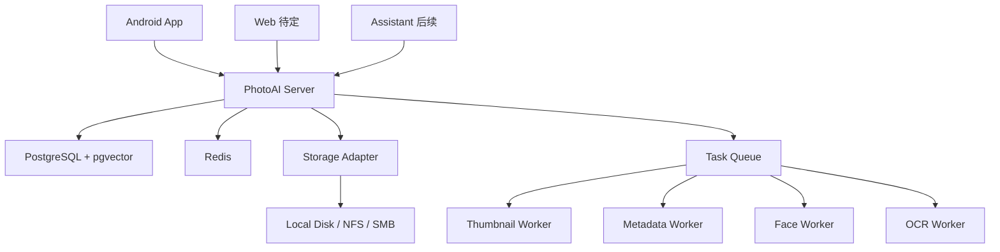

# PhotoAI 系统架构与开发顺序

## 总体架构



## 仓库结构

```text
photoai
├── server
│   ├── app
│   │   ├── api
│   │   ├── auth
│   │   ├── users
│   │   ├── assets
│   │   ├── storage
│   │   ├── upload
│   │   ├── metadata
│   │   ├── thumbnails
│   │   ├── ai
│   │   ├── faces
│   │   ├── ocr
│   │   ├── search
│   │   ├── jobs
│   │   ├── config
│   │   └── common
│   ├── migrations
│   ├── tests
│   └── pyproject.toml
├── workers
│   ├── thumbnail_worker
│   ├── metadata_worker
│   ├── face_worker
│   └── ocr_worker
├── android
│   └── app
├── web
├── deploy
│   ├── docker-compose.yml
│   └── docker-compose.dev.yml
└── docs
```

## 后端模块边界

| 模块 | 职责 |
|---|---|
| auth | 本地登录、Token、OIDC、当前用户 |
| users | 用户资料、状态、容量统计 |
| storage | 存储位置、路径生成、文件读写 |
| upload | 上传会话、分片、合并、校验 |
| assets | 资产入库、列表、详情、删除、收藏 |
| metadata | EXIF、媒体宽高、GPS、视频时长 |
| thumbnails | thumbnail、preview、video cover |
| ai | 任务、结果、模型、节点 |
| faces | 人脸、人名、聚类关系 |
| ocr | OCR 结果、文字块 |
| search | 关键词、OCR、人物、标签聚合搜索 |
| jobs | 队列封装、重试、任务派发 |

## Android 模块边界

| 模块 | 职责 |
|---|---|
| auth | 登录、Token 存储、刷新 |
| media | MediaStore 扫描、权限适配 |
| backup | 上传队列、约束、重试、进度 |
| localdb | Room 本地状态 |
| api | Retrofit 或 OkHttp API 客户端 |
| gallery | 照片列表和详情 |
| settings | 备份策略、账号、隐私 |
| common | 日志、错误、工具类 |

## 开发顺序

### Stage 1：后端骨架

交付物：

- `server` 项目初始化。
- 配置系统。
- PostgreSQL 连接。
- Alembic 迁移。
- 统一响应和异常格式。
- `GET /api/health`。

完成标准：

- 本地能启动 API。
- 能执行 `alembic upgrade head`。
- 健康检查返回数据库和 Redis 状态。

### Stage 2：用户与认证

交付物：

- `users`、`user_auth_identities`、`user_settings` 表。
- 本地账号注册和登录。
- JWT access token + refresh token。
- 当前用户接口。

完成标准：

- Android 和 API 客户端可登录。
- 所有受保护接口必须通过当前用户。

### Stage 3：存储与上传

交付物：

- `storage_locations`、`libraries`。
- StorageAdapter。
- 上传会话 API。
- 分片上传、合并、hash 校验。
- `assets`、`asset_files` 入库。

完成标准：

- 100MB 文件可分片上传并校验。
- 同一用户相同 hash 不重复入库。

### Stage 4：Android 登录与扫描

交付物：

- 登录页。
- Token 安全保存。
- 相册权限适配。
- MediaStore 扫描。
- Room 本地资产表。

完成标准：

- 能列出本机照片和视频。
- 重启 App 后状态不丢失。

### Stage 5：Android 自动备份

交付物：

- 备份策略。
- WorkManager 后台任务。
- 分片上传客户端。
- 上传进度 UI。
- 失败重试。

完成标准：

- 可自动备份 1000 张照片。
- 断网恢复后继续上传。

### Stage 6：媒体处理 Worker

交付物：

- 缩略图任务。
- EXIF 任务。
- Worker 领取和回传。
- 任务失败重试。

完成标准：

- 上传后自动生成 thumbnail 和 preview。
- Android 列表使用 thumbnail。

### Stage 7：Android 相片浏览

交付物：

- 远端资产分页列表。
- 缩略图加载。
- 照片详情。
- 收藏、删除基础操作。

完成标准：

- 用户能从 Android 浏览已备份照片。

### Stage 8：AI 基础

交付物：

- OCR Worker。
- Face Worker 基础检测。
- `ai_results`、`ocr_results`、`faces` 入库。
- 基础搜索接口。

完成标准：

- 截图能识别文字并搜索。
- 有人脸照片能保存人脸框。

